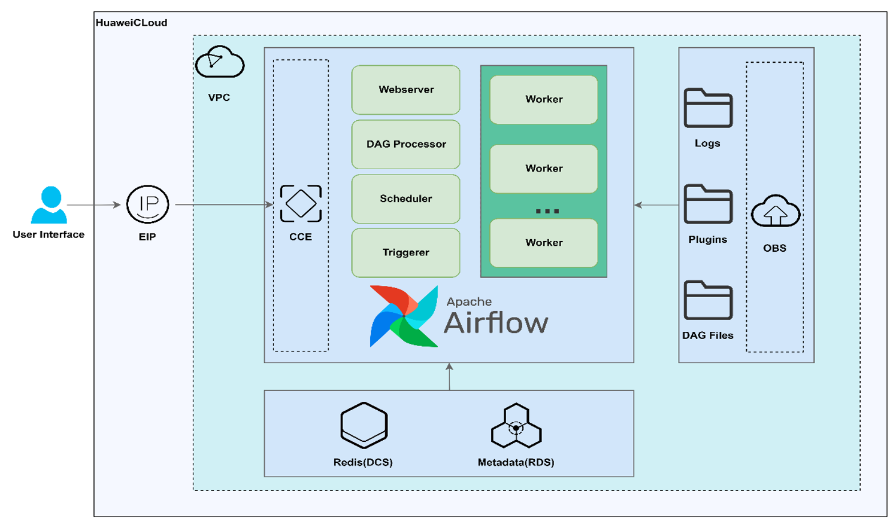
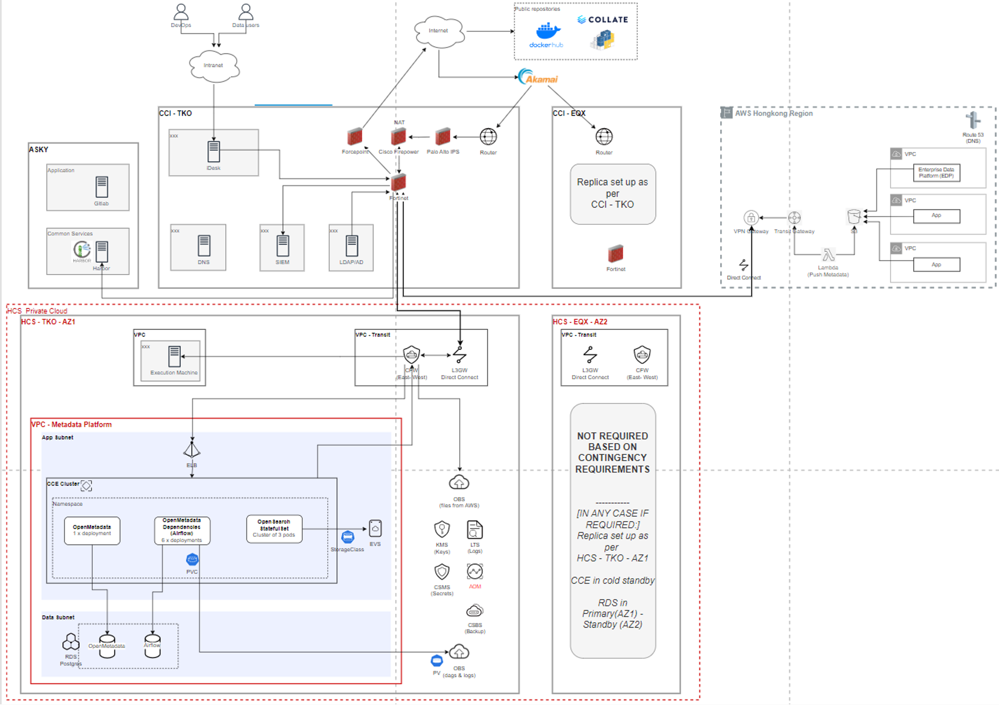

<!-- markdownlint-disable -->
<h1 align="center">
    大数据场景化方案
     
</h1>

## Contents

- [开源工作流平台 Airflow 的构建](#1)
- [元数据平台 MetadataHub 基于私有云的部署](#2)

## 开源工作流平台 Airflow 的构建 

_基于华为云进行 Airflow 集群的部署与自动托管，提供相关插件与技术支持帮助用户实现跨云迁移。_

<b>场景优势</b>

- 提供稳定的 Airflow 集群部署及自动托管，保障服务的可靠性与连续性。
- 通过华为云服务相关连接器，简化迁移流程，降低迁移难度，提高迁移效率。
- 提供脚本编程优化能力，可根据实际需求灵活定制和优化，满足多样化业务场景需求。

<b>推荐搭配</b>

- 开源镜像：[Airflow工作流平台](https://marketplace.huaweicloud.com/hidden/contents/1fe654fa-4bc6-4386-90de-f27961f5f8cc#productid=OFFI1137281825272061952)
- 社区仓库：[GitCode](https://gitee.com/HuaweiCloudDeveloper/huaweicloud-airflow-provider)、[GitHub](https://github.com/HuaweiCloudDeveloper/HuaweiCloud-Airflow-provider)、[Gitee](https://gitee.com/HuaweiCloudDeveloper/huaweicloud-airflow-provider)

<b>典型案例</b>

- [华为云DTSE团队通过开源专业服务，助力马来西亚X集团平滑迁移上云](https://bbs.huaweicloud.com/blogs/435840)

## 元数据平台 MetadataHub 基于私有云的部署 

_本方案聚焦用户在资源协同、数据管理、IT 环境及运营成本等方面的核心诉求，依托华为云服务（HCS）构建元数据管理解决方案。_

<b>场景优势</b>

- 资源协同与数据管理强化：华为云 HCS 开发的数据组件显著增强用户高并发数据分析能力，同时通过安全存储与高效开发模式，解决数据存储风险问题，提升数据全生命周期管理效率。
- IT 环境多元化转型：依托华为云丰富的技术生态，帮助用户突破单一 IT 环境限制，实现向多元化、弹性化 IT 架构转型，满足业务发展对技术环境多样性的需求。 
- 降本增效与业务扩张：优化部署架构、自动化运维及云服务资源弹性调度，有效降低运营成本；同时通过稳定、可扩展的技术方案，为业务扩张提供坚实的基础设施支撑，助力制定科学的云战略。 
- 技术架构稳健可靠：CCE 部署保障系统扩展性与性能稳定性；替换关键数据源增强系统可用性；全链路安全防护确保数据安全合规；自动化部署大幅减少运维工作量，降低人力成本与操作风险，提升整体运维效率。

