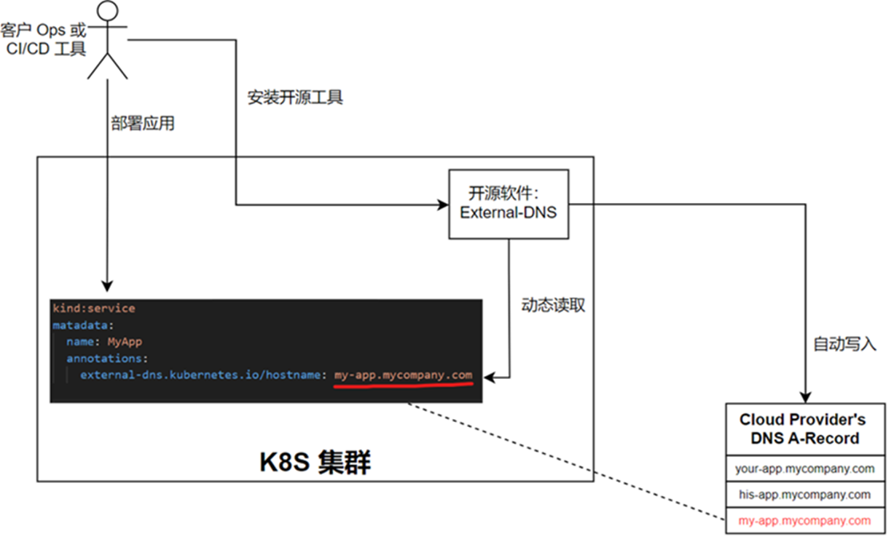
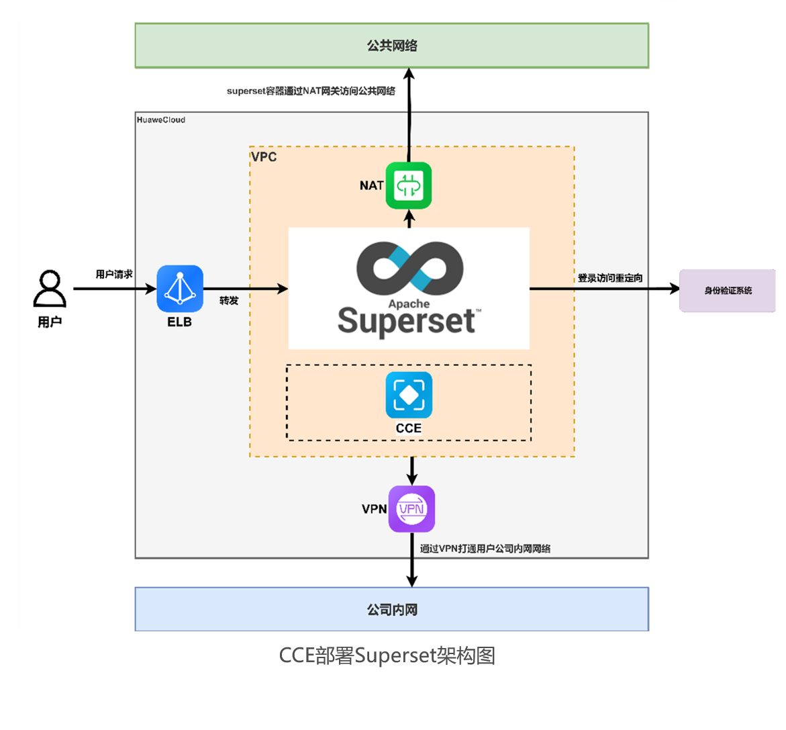
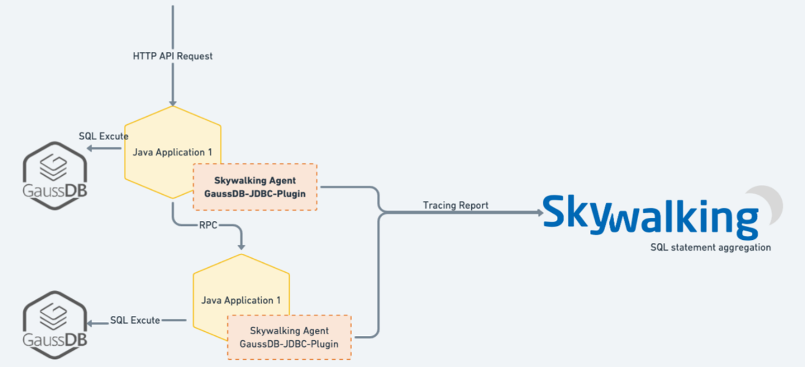
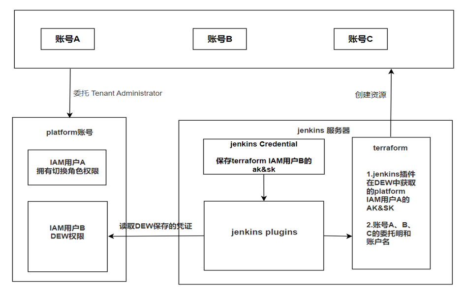

<!-- markdownlint-disable -->
<h1 align="center">
    云原生场景化方案
     
</h1>

## Contents

- [开源工具 External-DNS 应用部署](#1)
- [开源智能平台 Superset + CCE 的构建](#2)
- [基于 SkyWalking 监控 GaussDB SQL信息](#3)
- [Jenkins + Terraform 凭证加密部署](#4)

## 开源工具 External-DNS 应用部署 

_满足使用 External-DNS 实现应用部署时更新云厂商 DNS 的 A-Record 以完成自动化 CI/CD 闭环的需求。_

<b>场景优势</b>

- 集成 External-DNS 与华为云 DNS 解析服务，补齐 CICD 流程。 
- 采用 CCE 工作负载 identity 方式赋予 pod IAM 权限，保障安全可靠。 
- 为 IT 人员提供华为云服务及 External-DNS 使用赋能培训，助力快速掌握与使用。

<b>推荐搭配</b>

- 社区仓库：[GitHub](https://github.com/setoru/external-dns-huaweicloud-webhook)

## 开源智能平台 Superset + CCE 的构建 

_本方案通过 Superset + CCE 构建弹性商业智能平台，替代传统报表工具，从容应对高并发；同时，基于Key Cloak 身份验证系统进行定制开发，筑牢数据安全防线。_

<b>场景优势</b>

- 实时全面：突破数据局限，实时采集更新，高效处理百万级数据，保障决策依据准确。
- 分析强大：支持复杂数据分析挖掘，助力企业洞察数据价值。 
- 高效美观：快速生成直观美观报表，提升数据传达效率。 
- 安全协作：通过身份验证系统对接与权限管理，实现安全共享与多人协作 。

## 基于 SkyWalking 监控 GaussDB SQL信息 

_本方案通过监控平台 SkyWalking 从应用层面定位 SQL 问题，使 SkyWalking 原生支持 GaussDB 的 JDBC 的访问监控和链路采集。_

<b>场景优势</b>

- 性能显著提升：通过优化接口及 SQL，有效降低 GaussDB 负载约 10%，接口响应速度提升约 60%，极大提升应用稳定性，为用户带来流畅使用体验。 
- 运维高效便捷：借助可视化的慢 SQL 及链路信息展示，运维人员可快速定位与慢 SQL 相关的应用、接口及实例，大幅提升运维效率，减少故障排查时间成本，保障系统高效运行。

<b>推荐搭配</b>

- 开源镜像：[skywalking-gaussdb-jdbc](https://marketplace.huaweicloud.com/contents/1d2cb9ae-f037-4145-a844-a44e887205a0#productid=OFFI959025172387434496)
- 社区仓库：[Gitee](https://gitee.com/HuaweiCloudDeveloper/Skywalking-GaussDB-JDBC)

## Jenkins + Terraform 凭证加密部署 

_为实现安全高效的云资源自动化部署，采用技术组合优化方案。开发定制化 Jenkins 插件，对接华为云 DEW 服务，使 Jenkins 能够从该服务获取加密凭证，有效解决凭证安全问题，提升自动化工作流的安全性与流畅度；同时提供基于加密凭证创建云资源的 Terraform 模板，通过标准化配置实现云资源自动化部署，促进团队协作，保障云资源管理全流程的连贯性。_

<b>场景优势</b>

- 强化安全防护：通过加密凭证管理，密钥管理服务不存储明文或密文数据加密密钥，依托用户主密钥管理体系，全方位保障数据加密密钥的安全获取与使用，杜绝因凭证暴露引发的数据泄露、资源篡改等风险。
- 提升部署效率：借助 Terraform 脚本实现云资源批量自动化部署，相较于传统方式大幅缩短部署时间，显著提升云资源部署效率，加速项目交付进程，为业务快速上线提供有力支持。

<b>推荐搭配</b>

- 社区仓库：[GitCode](https://gitcode.com/HuaweiCloudDeveloper/huaweicloud-jenkins-plugins)、[Gitee](https://gitee.com/HuaweiCloudDeveloper/huaweicloud-jenkins-plugins)

